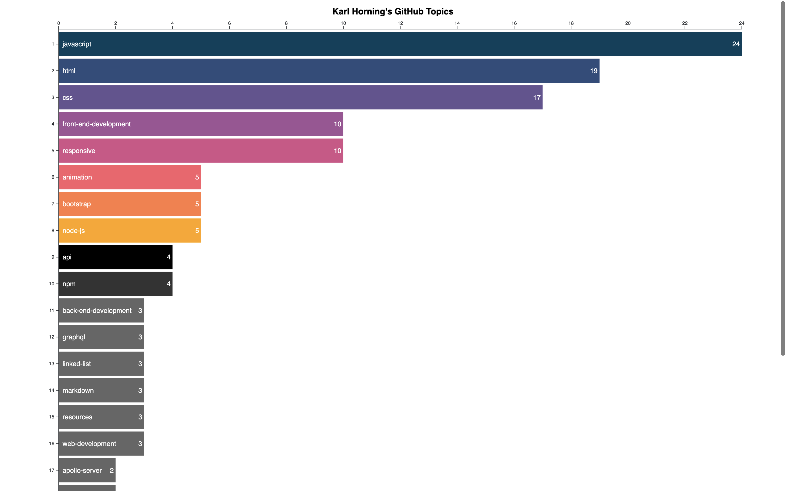

# 🧠 GitHub API with D3

---

## 📖 Table of Contents

- [🧠 GitHub API with D3](#-github-api-with-d3)
  - [📖 Table of Contents](#-table-of-contents)
  - [🤓 Overview](#-overview)
  - [📸 Demo](#-demo)
  - [🛠️ Tech Stack](#️-tech-stack)
  - [📦 Installation](#-installation)
  - [🚀 Scripts](#-scripts)
  - [📁 Project Structure](#-project-structure)
  - [📌 To Do](#-to-do)
  - [🧪 Known Issues](#-known-issues)
  - [🤝 Contributing](#-contributing)
  - [📚 Acknowledgements](#-acknowledgements)
  - [📄 Licence](#-licence)
  - [👤 Author](#-author)

---

## 🤓 Overview

A simple D3-powered web app that fetches and visualises GitHub repository topics using the GitHub API. It defaults to [Karl-Horning](https://github.com/Karl-Horning) but can be adapted to display any GitHub user's public repos.

---

## 📸 Demo



Runs locally at: [http://localhost:3000](http://localhost:3000)

---

## 🛠️ Tech Stack

- **Frontend**: D3.js, Bootstrap
- **Backend**: Express
- **API**: GitHub REST API via `@octokit/core`
- **Languages**: JavaScript (Node.js)
- **Tooling**: Chalk, Dotenv

---

## 📦 Installation

```bash
git clone https://github.com/Karl-Horning/github-api-with-d3.git
cd github-api-with-d3
npm install
```

---

## 🚀 Scripts

| Command     | Description              |
| ----------- | ------------------------ |
| `npm start` | Start the Express server |

---

## 📁 Project Structure

```bash
/
├── public/              # Static assets (if applicable)
├── src/
│   ├── public/img/      # Visual assets for the UI
│   ├── routes/          # Express routes
│   ├── utils/           # Utility functions
│   └── views/           # HTML and D3 code
├── .env.example         # Example environment file
└── index.js             # Entry point
```

---

## 📌 To Do

- [ ] Add user input to customise GitHub username
- [ ] Refactor into reusable chart components
- [ ] Add tests and CI config

---

## 🧪 Known Issues

- Does not yet support private repositories
- Chart styling can break on very small screens

---

## 🤝 Contributing

Pull requests are welcome! Please fork the repo and use a feature branch.

```bash
git checkout -b your-feature-name
```

Once your changes are ready, open a pull request with a clear description.

---

## 📚 Acknowledgements

- [D3.js](https://d3js.org/)
- [Express](https://expressjs.com/)
- [@octokit/core](https://github.com/octokit/core.js)
- [Chalk](https://www.npmjs.com/package/chalk)
- [Dotenv](https://www.npmjs.com/package/dotenv)
- [Bootstrap](https://getbootstrap.com/)

---

## 📄 Licence

MIT © 2025 Karl Horning

---

## 👤 Author

Made with ❤️ by [Karl Horning](https://github.com/Karl-Horning)
