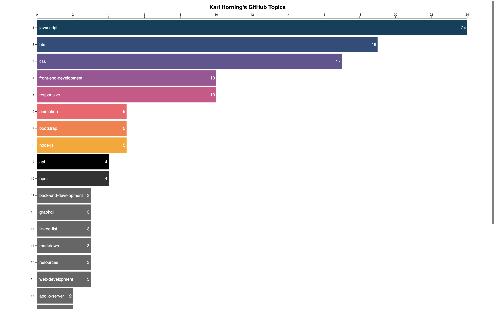

# GitHub API with D3

A proof-of-concept Express app that fetches GitHub repository topics via the GitHub API and renders them as an animated D3 bar chart. Built to explore live portfolio data visualisation; cut because topic counts vary too much between accounts to style consistently.

## Demo



## Tech stack

- **Frontend**: D3.js, Bootstrap
- **Backend**: Express
- **API**: GitHub REST API via `@octokit/core`

## Installation

1. Clone the repository and install dependencies:

   ```bash
   git clone https://github.com/Karl-Horning/github-api-with-d3.git
   cd github-api-with-d3
   npm install
   ```

2. Copy `.env.example` to `.env`.
3. Add your GitHub personal access token as `API_KEY` and your GitHub username as `GITHUB_USERNAME`.

## Scripts

| Command       | Description                       |
| ------------- | --------------------------------- |
| `npm start`   | Start the Express server          |
| `npm run dev` | Start with nodemon (auto-restart) |

## Project structure

```text
/
├── src/
│   ├── libs/          # GitHub API data-fetching and topic aggregation
│   └── public/
│       ├── html/      # Main HTML entry point
│       ├── img/       # Preview assets
│       └── js/        # D3 chart logic and bundled D3 library
└── index.js           # Express server entry point
```

## Licence

MIT © 2024 [Karl Horning](https://github.com/Karl-Horning)
